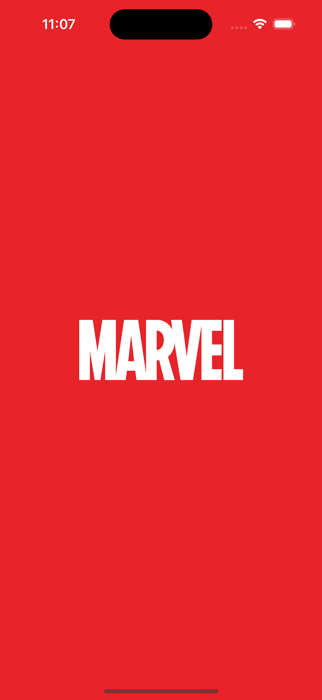
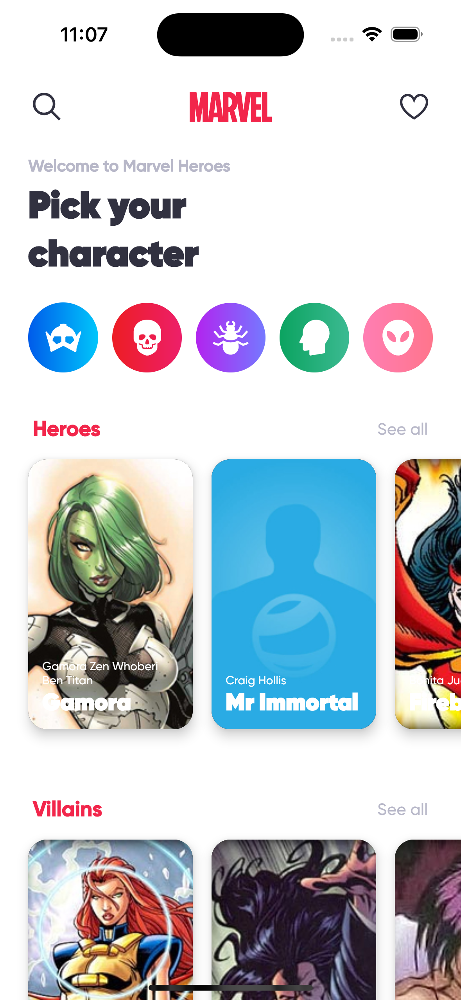
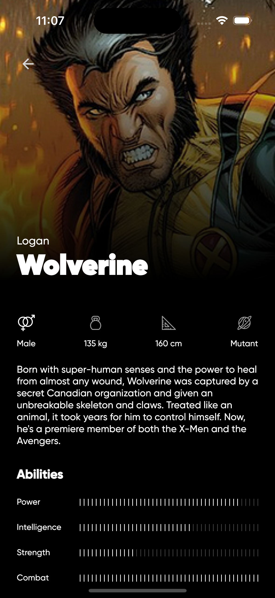
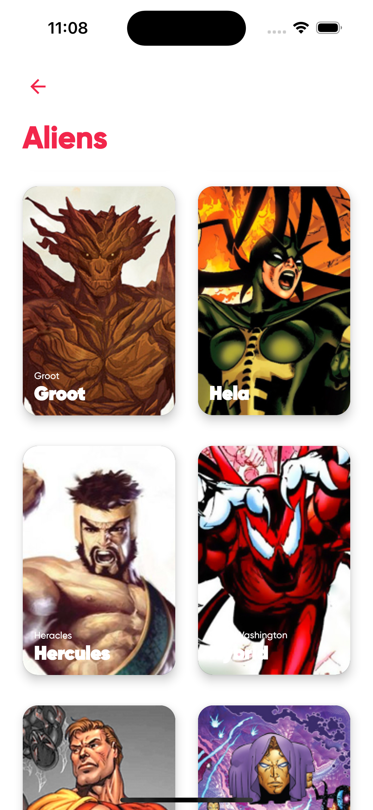
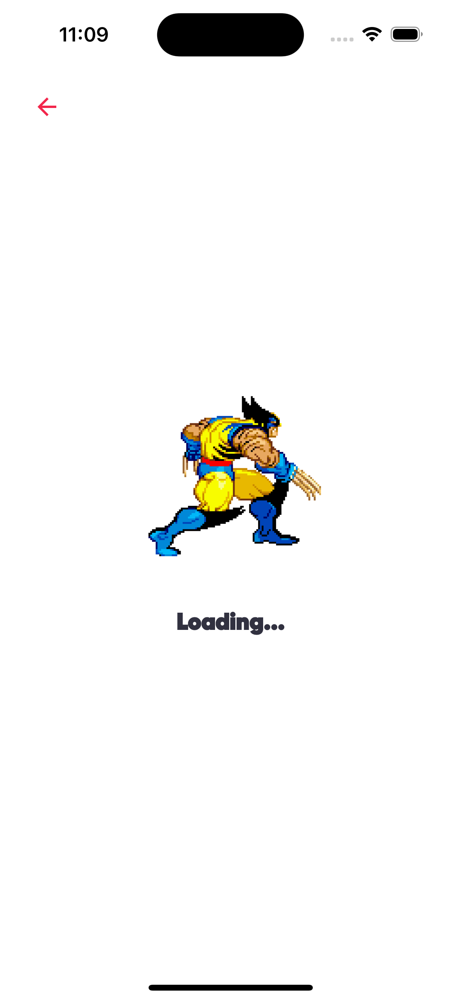
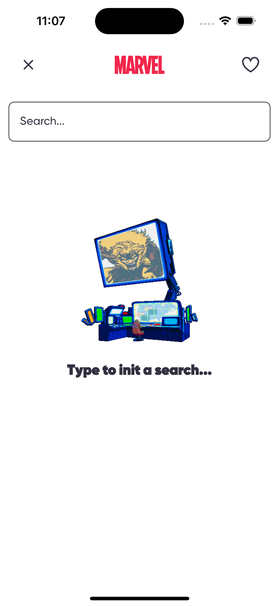
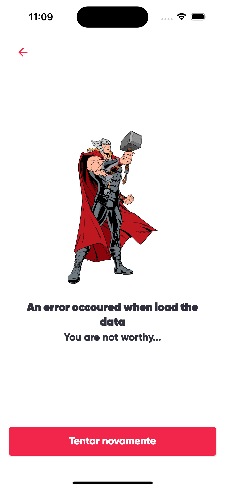

<h1 align="center">
 
  
 
 
Marvel App KMP
</h1>

App desenvolvido como projeto para um grupo de estudos em compose multiplataform

  

# 📋 Índice

- [Telas](#-Telas)
- [Sobre o projeto](#-Sobre-o-projeto)
- [Tecnologias utilizadas](#-Tecnologias-utilizadas)
- [Rodando o projeto](#-Rodando-o-projeto)
  - [Pré-requisitos](#-Pré-requisitos)
  - [Rodando o app](#-Rodando-o-app)

## 🎨 Telas

## 📃 Sobre o projeto

A proposta é desenvolver um app em dupla que consuma uma api e liste seus dados usando compose
multiplatform e libs relacionadas.
O figma do layout pode ser
encontrado <a href="https://www.figma.com/community/file/849367817302905364/marvel-heroes" target="_blank">
aqui</a>
Neste projetos usamos a API da <a href="https://developer.marvel.com/" target="_blank">marvel</a> e
a <a href="https://github.com/akabab/superhero-api/tree/0.3.0/" target="_blank">superheroapi</a>
para listar os personagens, suas habilidades e seus quadrinhos.
As animações de carregamento e de erro mudam aleatoriamente :)

## 🛠 Tecnologias utilizadas

- 📱 **Compose multiplatform** — Aplicativo mobile
- 📡 **Ktor** — Chamadas para a API
- 🪙 **Koin** — Injeção de dependênÏtentcia
- 🛳️ **Voyager** — Navegação
- 📝 **Napier** — Logs
- 🖼️ **Coil** — Carregamento e manipulação de imagens vindas da API e renderização de gifs

## 🚀 Rodando o projeto

### Pré-requisitos

- Git

### 📱 Rodando o app

<ol>
  <li>Abra a pasta raiz do projeto no Android Studio</li>
  <li>Localize o arquivo `local.properties`</li>
  <li>Adicione as seguintes linhas:

    # Adicione suas chaves da api da marvel aqui
    PUBLIC_KEY=""
    PRIVATE_KEY=""

  </li>
  <li>Instale o ASDF (caso não esteja já instalado). https://asdf-vm.com/pt-br/guide/getting-started.html#_1-instalando-as-dependencias</li>
  <li>Adicione o plugin ruby:

    asdf plugin add ruby

  </li>
  <li>Instale as dependências do asdf:

    asdf install

  </li>
  <li>Instale as dependências do gem:

    bundle install

  </li>
  <li>Rode o app</li>
</ol>
